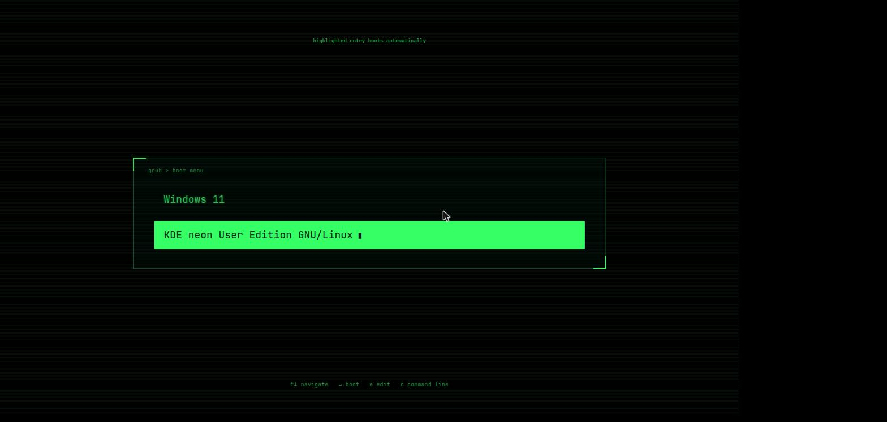

# Hacker Green — GRUB boot theme

A Full HD (1920x1080) GRUB2 theme: black CRT-style screen, glowing green
monospace text (Hack font), scanline overlay, ASCII-style corner brackets
around the boot menu.

## Preview



## Requirements

- GRUB 2.06+ (tested on GRUB 2.12 / Ubuntu 24.04 based systems)
- `imagemagick`, `grub-common` (for `grub-mkfont`)
- the [Hack](https://sourcefoundry.org/hack/) font (`fonts-hack-ttf` on Debian/Ubuntu) — only needed to rebuild assets with `scripts/build.sh`, not to install

## Install

```
sudo bash scripts/install.sh
```

This backs up `/etc/default/grub` and `/boot/grub/grub.cfg` with a timestamp,
copies the theme into `/boot/grub/themes/hacker-green/`, sets `GRUB_THEME`,
`GRUB_GFXMODE="1920x1080,auto"` and `GRUB_TIMEOUT_STYLE="menu"`, then runs
`update-grub`. Every step is validated; on any failure it rolls back
automatically. The `auto` fallback in `GRUB_GFXMODE` means GRUB drops to a
supported resolution instead of failing if 1920x1080 isn't available.

## Test without touching the real bootloader

```
sudo apt install grub-emu
sudo bash scripts/test-in-emulator.sh
```

Runs the *installed* theme inside `grub-emu` (a real GRUB core in an SDL
window) and saves a screenshot to `.emu/screenshot.png`. Useful for catching
theme.txt errors before rebooting.

## Rebuild assets from scratch

```
bash scripts/build.sh
```

## License

MIT — see [LICENSE](LICENSE).
